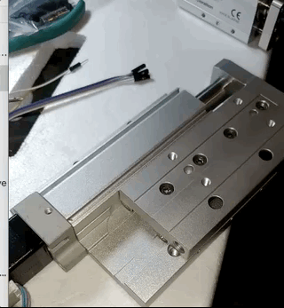
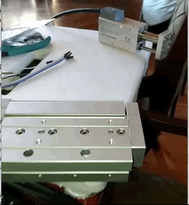

# RPI-ModbusClient
A Modbus Client/Master for PLC controller, base on QT5

  
TOYO controller in action
![Toyo TC100] 
  
IAI controller in action
![IAI] 
  

# MBPoll command line read RTU:
---
    #!/bin/bash
    #check TC100 model name
    #
    mbpoll -b19200 -Pnone -t4:hex -r 0x10E0 -0 -c3 /dev/ttyS0 -1
    mbpoll -b19200 -Pnone -t4:hex -r 0x10F0 -0 -c1 /dev/ttyS0 -1

### References
  - [MBPoll](https://github.com/epsilonrt/mbpoll)

